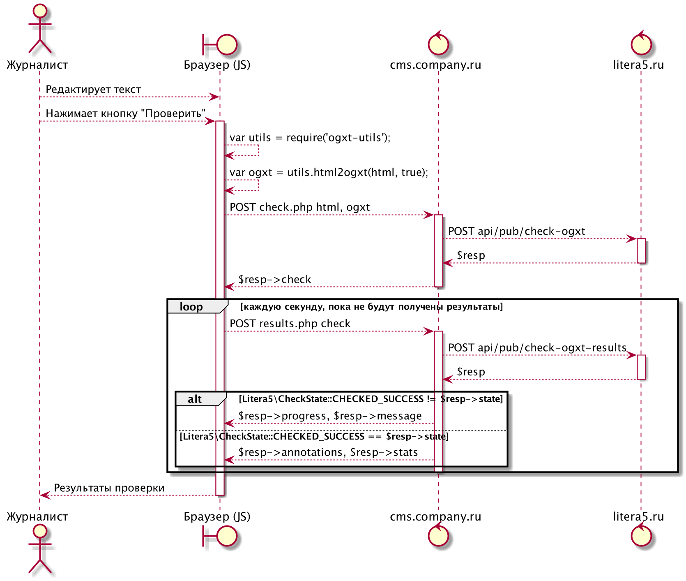

# Пример использования API PHP для организации проверки без iFrame с самостоятельным отображением результатов

* `check.php` — скрипт инициации проверки
* `results.php` — скрипт выяснения хода проверки

### Диаграмма последовательности действий


### Пример использования
Чтобы запустить прилагаемы пример необходимо зарегистрироваться в [Литере](https://litera5.ru) и получить секретный ключ для работы с API

Этот секретный ключ и идентификатор клиента Литеры нужно указать в файле `_litera5_api_config.php`

Далее, можно использователь следующие отладочные команды для проверки:

Запустить отладочный сервер PHP
```bash
> ./__run.server.sh
```

Начать тестовую проверку документа с текстом из файлов примера `__sample.html` и `__sample.ogxt`
```bash
> ./__check.curl.sh "litera5-user" "$(cat ./__sample.html)" "$(cat ./__sample.ogxt)"
```

В результате работы этого скрипта вы получите идентификатор проверки, который надо будет передать в качестве параметра в скрипт `results.php` выполнив команду:
```bash
> ./__results.curl.sh "check-id"
```